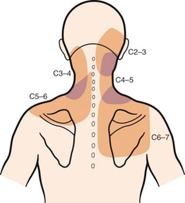

```{r setup, include=FALSE}
knitr::opts_chunk$set(echo = TRUE ,error=TRUE,message=FALSE,warning=FALSE,comment=NA,
          fig.width=9,fig.asp=0.618,fig.align='center',dpi=300,out.width='100%')
```


# 경추질환{.tabset}

## 통증위치 {.tabset}

### 디스크성, 축성통증 {-}

목(경추)의 병인은 단순염좌, 디스크 내장증, 디스크탈출과 방사통, 후관절증, 경수척수증이 있을 수 있습니다.

또한 경추부 구조물의 손상이 **뒤통수, 뒷목, 어깻죽지와 승모근, 어깨와 견갑골**에 **전형적으로** 통증을 만듭니다.

논문에 발표된 그림은 아래와 같습니다.


```{r, echo=FALSE, out.width='50%',out.height='100%', fig.align='default',fig.show='hold'}
knitr::include_graphics("image/education/cer2.jpg")

```

디스크 손상으로 인한 연관통 부위          | 후관절로 인한 연관통 부위
------------- | -------------
  | 

### 디스크탈출증, 방사통 {-}

```{r, echo=FALSE, out.width='100%',out.height='100%', fig.align='center',fig.show='hold'}
knitr::include_graphics("cDer.jpg")
```
<br/>
<center>
신경뿌리병증으로 인한 방사통 부위
</center>

## 경추의 손상

목을 앞으로 구부렸을 때 힘을 받으면 수핵이 뒤로 탈출되거나 수핵이 뒤로 밀리면서 섬유륜이 찢어지며 발생합니다. 
큰 힘을 갑자기 받아도 발생하지만, 작은 힘을 오랬동안 받아도 발생합니다.

```{r, echo=FALSE, out.width='100%',out.height='100%', fig.show='hold'}
knitr::include_graphics("textneck.png")
```

```{r, echo=FALSE, out.width='80%',out.height='100%', fig.align='center',fig.show='hold'}
knitr::include_graphics("discinj1.jpg")
```

디스크에 나쁜 자세를 피하고 좋은 자세와 운동을 하는 것이 근본적인 치료입니다.

## 나쁜 자세와 나쁜 운동

목 디스크에 나쁜 자세란 척추의 '후만자세'와 머리가 몸의 중심을 벗어난 자세로서, 

**고개를 숙인자세, 고개를 앞으로 내민자세, 허리를 굽혀 머리가 앞으로 나간 상태, 한방향으로 목을 돌리고 있는 자세, 높고 딱딱한 배게사용**를 오랫동안 하지 않는 것입니다.


```{r, echo=FALSE, fig.align='default', out.width = '50%',fig.show='hold'}
knitr::include_graphics("wrong.png")
knitr::include_graphics("c_wrong.png")
```

## 경부통의 재활 {.tabset}

### 1단계 {-}
좋은 자세: 전만자세 유지, 고개내밀지 않기, 숙이지 않기

경부 재활 1단계: 척추위생 지키기, 스스로 머리위치 자주 확인하기, 맥켄지 신전운동, 견갑골 후인운동. 

```{r, echo=FALSE, fig.align='center', out.width = '100%'}
knitr::include_graphics("sagBal.png")
knitr::include_graphics("cEx0.png")
```

### 2단계 {-}
경부 재활 2단계: 경부의 굴곡, 신전, 측굴 근육의 등척성운동, 탄력밴드 등척성 운동.

**초기에는 절대 하지 마세요**

```{r, echo=FALSE, fig.align='center', out.width = '50%'}
knitr::include_graphics("cEx1.jpg")
```

```{r, echo=FALSE, fig.align='center', out.width = '100%'}
knitr::include_graphics("cEx2.jpg")
```

### 척추 주사 {-}

통증이 심할 때 소염진통제를 통해 통증을 조절할 수 있습니다.

소염진통제로 해결되지 않을 경우 스테로이드 주사를 통해 신경 뿌리의 염증을 줄여서 통증을 가라앉힐 수 있습니다.


```{r, echo=FALSE, fig.align='center', out.width = '100%'}
knitr::include_graphics("cTfesi.jpg")
```


팔의 힘이 중요한 정도로 떨어지거나, 다리 힘이 약해지거나 대소변 보는데 장애가 발생할 경우 수술을 고려해볼 수 있습니다.


***

# 요추질환{.tabset}

## 허리의 통증 {.tabset}

### 디스크 통증, 축성 통증 {-}
허리(요추)의 병인은 단순염좌, 디스크 내장증, 디스크탈출과 방사통, 후관절증, 척추관협착증 등이 있을 수 있습니다.

또한 요추부 구조물의 손상이 **허리, 골반, 엉치, 엉덩이, 사타구니**에 **전형적으로** 통증을 만듭니다.

논문에 발표된 그림은 아래와 같습니다.


```{r, echo=FALSE, out.width='50%',out.height='100%', fig.align='default',fig.show='hold'}
knitr::include_graphics("lum1.jpg")
knitr::include_graphics("lum2.png")
```

<br/>
<center>
디스크 손상으로 인한 연관통 부위
</center>


### 디스크탈출증, 방사통 {-}

디스크 탈출증으로 인한 방사통은 다리로 뻗쳐나가는 통증을 느낄 수 있습니다.

```{r, echo=FALSE, out.width='100%',out.height='100%', fig.align='center',fig.show='hold'}
knitr::include_graphics("lDer.jpg")
```
<br/>
<center>
신경뿌리병증으로 인한 방사통 부위
</center>


## 요추 손상

허리를 앞으로 구부렸을 때 힘을 받으면 수핵이 뒤로 탈출되거나 수핵이 뒤로 밀리면서 섬유륜이 찢어지며 발생합니다. 

큰 힘을 갑자기 받아도 발생하지만, 작은 힘을 오랬동안 받아도 발생합니다.


```{r, echo=FALSE, out.height='100%', fig.align='default',fig.show='hold'}
knitr::include_graphics("discinj2.jpg")
knitr::include_graphics("discinj1.jpg")
```

## 나쁜 자세와 운동 {.tabset}

### 나쁜 자세 {-}

```{r , echo=FALSE, fig.align='center', out.width = '100%'}
knitr::include_graphics("lWrong0.png")
```

### 나쁜 운동 {-}
윌리엄스 운동, 윗몸 일으키기, 다리 들어 올리기 등 **과도한 요추의 굴곡신전 반복**.

```{r , echo=FALSE, fig.align='center', out.width = '100%'}
knitr::include_graphics("lWrong1.png")
```

## 재활운동 {.tabset}

### 0단계 {-}

일상생활 중의 통증에서 벗어나는 단계 입니다.

척추를 '전만자세'로서 24시간 유지하고, 허리를 굽혔다 펴는 것을 반복하거나 굽히는 자세를 오래 하지 않은 것 입니다.

신경쓰지 않아도 자세가 유지되도록 습관화 시켜야합니다.
일반적으로 습관을 익히는 데 평균 66일이 걸립니다.

습관화 되면 **재발을 방지**할 수 있습니다.

```{r figure 2-2, echo=FALSE, fig.align='center', out.width = '100%'}
knitr::include_graphics("LBP.jpg")
knitr::include_graphics("Lor.jpg")
```
<br/>
<center>
태어나서부터 생기는 정상적인 경추와 요추의 전만(Lordosis).
</center>

### ABC 1단계 {-}
척추위생 지키기, 맥켄지 신전운동, 요추살림 걷기

```{r figure 2-3, echo=FALSE, fig.align='center', out.width = '100%'}
knitr::include_graphics("exercise1.jpg")
```

### ABC 2단계 {-}
광배근 운동, 엉덩이 운동, 엉덩관절 경첩훈련

```{r figure 2-4, echo=FALSE, fig.align='center', out.width = '100%'}
knitr::include_graphics("exercise2.jpg")
```

### ABC 3단계 {-}
맥길의 빅3(사이드브릿지, 상체살짝들기, 버드독자세, 플랭크)

```{r figure 2-5, echo=FALSE, fig.align='center', out.width = '100%'}
knitr::include_graphics("exercise3.jpg")
```

## 척추 주사

통증이 심할 때 소염진통제를 통해 통증을 조절할 수 있습니다.

소염진통제로 해결되지 않을 경우 스테로이드 주사를 통해 신경 뿌리의 염증을 줄여서 통증을 가라앉힐 수 있습니다.


```{r, echo=FALSE, fig.align='center', out.width = '100%'}
knitr::include_graphics("lTfesi.jpg")
```


다리의 힘이 중요한 정도로 떨어지거나, 대소변 보는데 장애가 발생할 경우 수술을 고려해볼 수 있습니다.


# 어깨질환 {.tabset}

## 어깨의 통증 {-}
어깨 통증의 흔한 원인은 유착성 관절낭염, 회전근개 질환, 석회성 힘줄염 등이 있을 수 있습니다.

## 유착성 관절낭염 {-}
```{r figure 3-1, echo=FALSE, fig.align='center', out.width = '100%'}
knitr::include_graphics("ACs.jpg")
knitr::include_graphics("AC.jpg")
```

## 회전근개염 / 회전근개힘줄증 / 회전근개힘줄파열 {-}
```{r figure 3-2, echo=FALSE, fig.align='center', out.width = '100%'}
knitr::include_graphics("RC.jpg")
```

## 회전근개 석회성 힘줄염 {-}
```{r figure 3-3, echo=FALSE, fig.align='center', out.width = '100%'}
knitr::include_graphics("shoulder_CT1.png")
```


***

# 무릎질환{.tabset}

## 무릎의 통증 {-}
무릎 통증의 흔한 원인은 생리적과사용으로 인한 스트레스, 퇴행성관절염, 활액막염, 그 외 원인으로 인한 관절염 등이 있을 수 있습니다.

## 생리적과사용 스트레스 {-}

무릎 관절에 힘이 많이 가해져서 뼈에 스트레스가 가해진 상태.
대사 증가와 미세골절이 있어 통증에 민감해진 상태

## 퇴행성관절염 {-}

무릎관절의 연골의 손상, 뼈의 골극 형성, 관절공간의 감소로 특징되는 질환.
오랜시간 동안 반복된 손상이 누적되어 보이는 것

## 활액막염 {-}

무릎관절 내부 구조물의 손상이 유발하는 관절 활액막의 염증
통증에 민감한 조직이라 심한 통증을 만들고, 구조적 손상없이도 주된 통증의 원인이 되기도함.
심한 경우 스테로이드 주사가 치료 효과가 있다.

## 무릎통증의 재활운동 {-}
```{r figure 4, echo=FALSE, fig.align='center', out.width = '100%'}
knitr::include_graphics("Knee.jpg")
```

# 팜플렛 모음 {.tabset}
고신대학교 복음병원 근골격계 재활 팜플렛


## 경부통

```{r, echo=FALSE, fig.align='center', out.width = '100%'}
knitr::include_graphics("neck.jpg")
```

## 요통  {.tabset}

### 자세관리 {-}

```{r, echo=FALSE, fig.align='center', out.width = '100%'}
knitr::include_graphics("LBP.jpg")
```

### 백년허리 - 좋은운동 {-}

```{r, echo=FALSE, fig.align='center', out.width = '100%'}
knitr::include_graphics("hundredyear1.jpg")
```

### 백년허리 - 나쁜운동 {-}

```{r, echo=FALSE, fig.align='center', out.width = '100%'}
knitr::include_graphics("hundredyear2.jpg")
```

## 어깨{.tabset}

### 오십견 {-}

```{r, echo=FALSE, fig.align='center', out.width = '100%'}
knitr::include_graphics("ACs.jpg")
```

### 오십견 운동 {-}

```{r, echo=FALSE, fig.align='center', out.width = '100%'}
knitr::include_graphics("AC.jpg")
```

### 회전근개 손상 재활 운동 {-}
```{r, echo=FALSE, fig.align='center', out.width = '100%'}
knitr::include_graphics("RC.jpg")
```

## 무릎
```{r , echo=FALSE, fig.align='center', out.width = '100%'}
knitr::include_graphics("Knee.jpg")
```